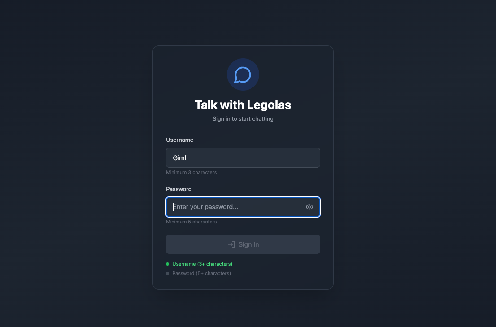
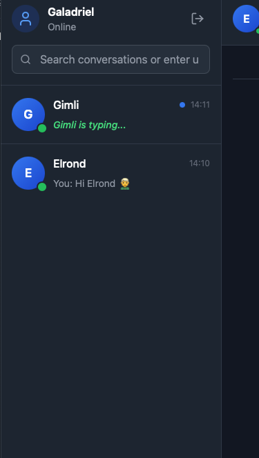
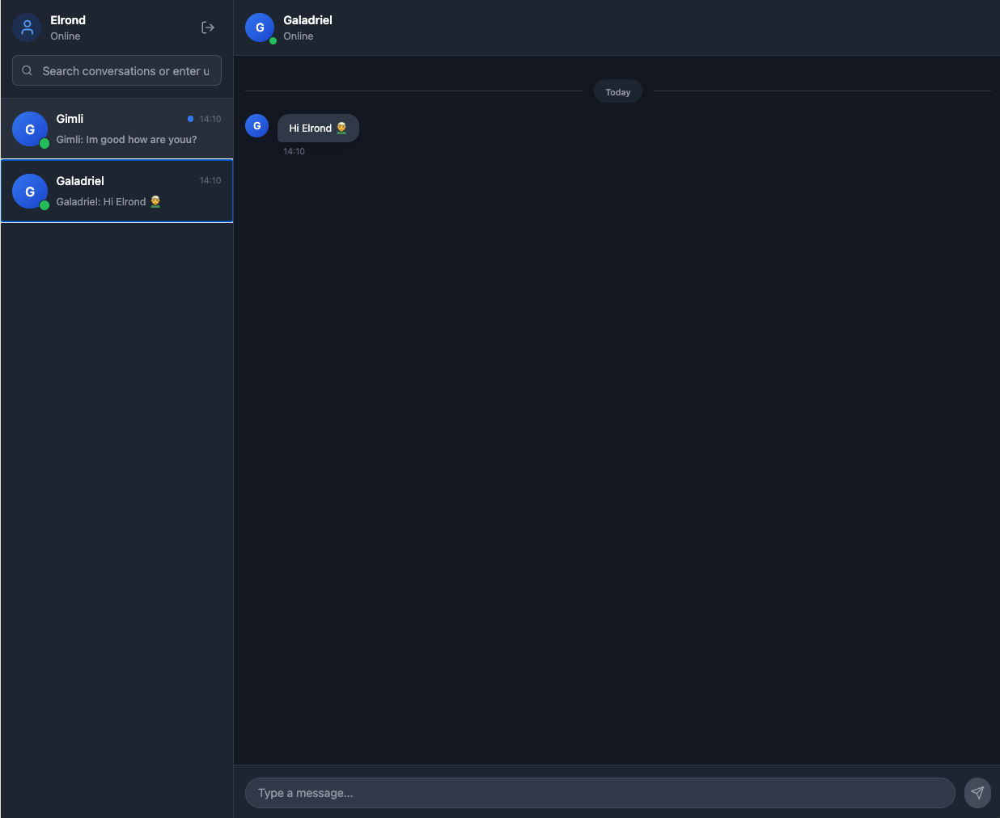

# Talk With Legolas

A real-time chat application built with modern web technologies, featuring instant messaging, presence indicators, and a beautiful user interface.

## Overview

Talk With Legolas is a full-stack chat application that enables real-time communication between users. The application showcases modern web development practices and real-time features including:

- Real-time messaging with WebSocket
- User presence indicators (online/offline status)
- Typing indicators
- JWT-based authentication
- Clean and intuitive user interface

## Screenshots

### Login Screen


### Chat List


### Chat Screen


## Technology Stack

### Frontend
- React with TypeScript
- tRPC client for type-safe API calls
- Tailwind CSS for styling
- Vite for development and building

[More details about the frontend →](./frontend/README.md)

### Backend
- Node.js with TypeScript
- tRPC for type-safe API endpoints
- Prisma with PostgreSQL for data management
- WebSocket for real-time communication
- Docker for containerization

[More details about the backend →](./backend/README.md)

## Features

- **Secure Authentication**: JWT-based authentication system
- **Real-time Messaging**: Instant message delivery using WebSocket
- **User Presence**: See who's online in real-time
- **Typing Indicators**: Know when others are typing
- **Thread Management**: Organize conversations in threads
- **Modern UI**: Clean and responsive design with Tailwind CSS

## Getting Started

1. Clone the repository
```bash
git clone https://github.com/yourusername/Talk-With-Legolas.git
cd Talk-With-Legolas
```

2. Set up the backend
```bash
cd backend
npm install
# Follow backend README for additional setup steps
```

3. Set up the frontend
```bash
cd frontend
npm install
# Follow frontend README for additional setup steps
```

## License

This project is licensed under the MIT License - see the [LICENSE](LICENSE) file for details.

## Contributing

Contributions are welcome! Please feel free to submit a Pull Request.
