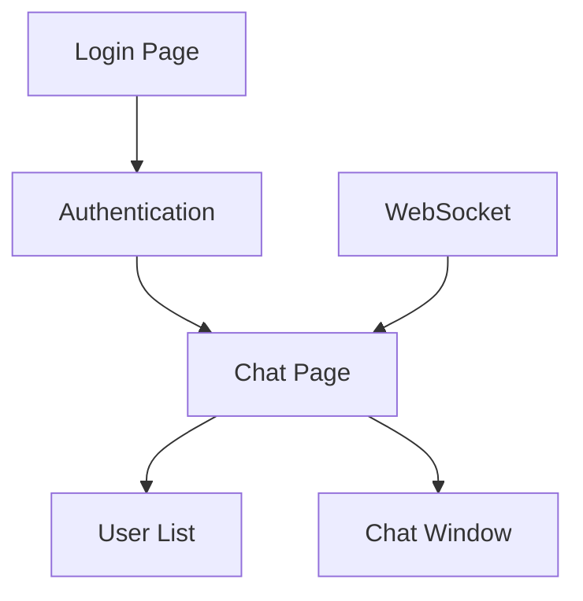

# Talk With Legolas - Frontend

A real-time chat application where users can log in and communicate with each other. Features instant messaging, chat history and real-time updates through WebSocket connections.

## Quick Start

```bash
# Install dependencies
npm install

# Start development server
npm run dev

# Build for production
npm run build
```

The development server runs on `http://localhost:8080` by default.

## Tech Stack

| Category | Technologies |
|----------|-------------|
| Core | React 18, TypeScript |
| Styling | TailwindCSS, Framer Motion |
| API | tRPC, TanStack Query |
| Build Tools | Vite, PostCSS |
| Date Handling | date-fns |
| Icons | Lucide React |

## How It Works



### Main Parts

- `Login Page`: Where users enter their credentials
- `Authentication`: Handles login/logout and keeps user logged in
- `Chat Page`: Main screen after login
- `User List`: Shows who's online
- `Chat Window`: Where messages are sent and received
- `WebSocket`: Keeps everything real-time

### How Data Flows

1. User logs in through `Login Page`
2. App saves login info for next time
3. User sees who's online in `User List`
4. Messages appear instantly in `Chat Window`
5. Everything updates in real-time for all users

## Development

- `npm run lint`: Run ESLint checks
- `npm run preview`: Preview production build locally

## Environment Variables

```env
VITE_API_URL=http://localhost:3000    # Backend API URL
VITE_WS_URL=ws://localhost:3000       # WebSocket URL
``` 